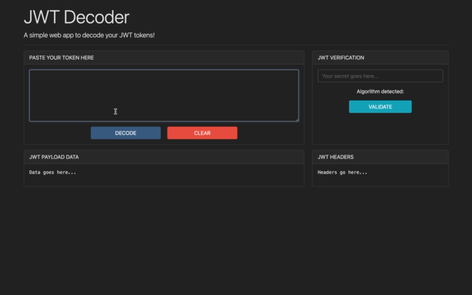
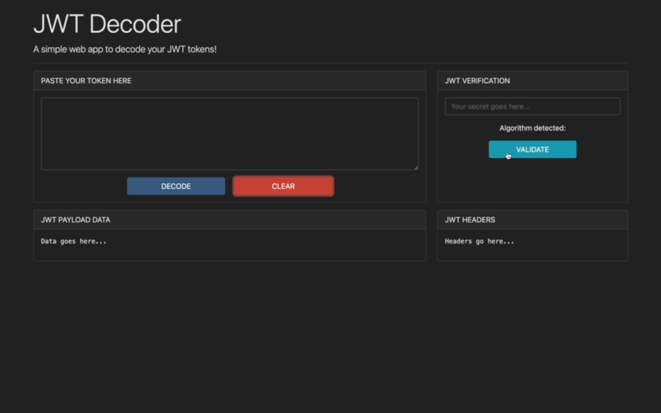

# JWT-Decoder-Client
A simple electron app to decode your JSON Web tokens. Supports decoding of all JSON web tokens and verification/expiry check on tokens encrypted with HMAC signing method (HS256, HS384, HS512).

The app is built using Bootstrap 5 ([bootstrap-dark-5](https://github.com/vinorodrigues/bootstrap-dark-5) used for automatic theme switching based on OS theme setting), ElectronJS and the following node modules:

- https://github.com/auth0/jwt-decode (For decoding)
- https://github.com/auth0/node-jsonwebtoken (For verification)

Installers are built using [electron-forge](https://www.electronforge.io/).

**Tested on MacOS and Windows, build available only for M1 Macs and Windows x64.**

## Link to Download:

https://1drv.ms/u/s!AoNKM5gi35IWhbpDvgFqQnRqHw0Q4Q?e=7xtFKE

## Build Instructions:
### Before building install all dependencies:
```
npm install
```

### To Build:

```
npm run make
```

## Demo:

### Dark mode using bootstrap-dark-5:


### Decoding JWT Token:



### Verification of JWT Token:



### Check for supported algorithms:


